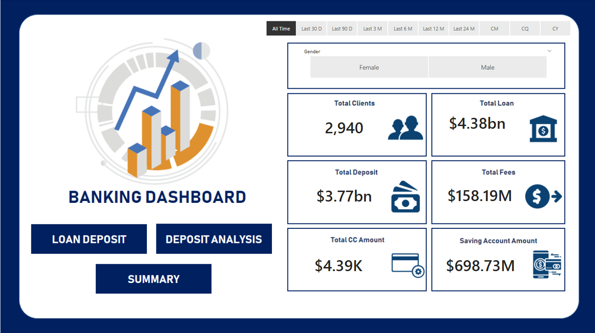

# 🏦 Comprehensive Banking Analysis Dashboard

Welcome to the **Banking Analysis Dashboard** project—a complete end-to-end analytical journey designed to transform raw banking data into business value using MySQL and Power BI.

## 🚦 Project Pipeline

Data Source → MySQL Database → Data Cleaning & Transformation → Exploratory Data Analysis → Power BI Interactive Dashboard

## 📂 Dataset Overview

- **Columns:** 24
- **Database:** MySQL

## 🔍 Data Preparation

- **Income Banding:** Classified customer `Income` into `Low`, `Mid`, and `High` bands using Power BI conditional columns.
- **Category Standardization:** Standardized categorical values for fields like gender and nationality.
    - Gender codes mapped: `'1'` → `Male`, `'2'` → `Female`
    - Branch codes translated to descriptive branch names.
- **Consistency:** Cleaned and unified categorical variables for downstream analytics.

## 🕵️ Exploratory Data Analysis (EDA)

### Categorical Insights

- Examined distribution among genders and nationalities.

### Numerical Insights

Focused on:
- Credit Card Balance
- Loans (Bank)
- Total Deposits
- Checking Account
- Saving Account
- Estimated Income
- Superannuation Savings

### Relationships & Trends

- **Strong Positive Correlations:** High balances in `Bank Deposits`, `Checking Account`, `Saving Account`, and `Foreign Currency Account` often co-exist. Customers showing high balance in one account type tend to hold substantial funds in others.

## 📑 Dashboard Breakdown (Power BI)

| Page              | Description                                                                     |
|-------------------|---------------------------------------------------------------------------------|
| **Home**          | Summarized data overview with highlights and aggregate visuals                   |
| **Loan Analysis** | In-depth analysis of loan products and customer segments                         |
| **Deposit Analysis**| Breakdown of deposits, account balances, and inter-account relationships       |
| **Summary**       | Correlations and demographic insights distilled from the data                    |

---
### ✅ Page 1: Home  
> Overview of the banking data with summary statistics and key visuals.  

---

### ✅ Page 2: Loan Analysis  
> Insights into loan distribution, types, and customer segments.  

---

### ✅ Page 3: Deposit Analysis  
> Breakdown of account balances, deposit types, and correlation patterns.  

---

### ✅ Page 4: Summary  
> Final insights from EDA, including correlations and demographic trends.  

## 🧰 Toolstack

- **Database Layer:** MySQL (for ETL and preparation)
- **Visualization:** Power BI (for interactive dashboarding)
- **Languages Used:** SQL, DAX (Power BI calculations)

## 🎯 Key Takeaways

- End-to-end implementation of data wrangling, EDA, and dashboarding.
- Practice with SQL-based data prep and Power BI’s conditional logic.
- Analysis reveals that customers with high balances exhibit cross-account wealth—a critical insight for bank product targeting.

## 📬 Conclusion

This project reinforces robust analytical skills in transforming banking data to clear, visual business insights by leveraging both SQL and Power BI. It highlights how targeted data preparation and nuanced exploratory analysis lead to meaningful, actionable strategies for financial institutions.

If you have questions or want to discuss the project further, feel free to reach out!

**Shantanu Roy**  
*shantanur003@gmail.com*
